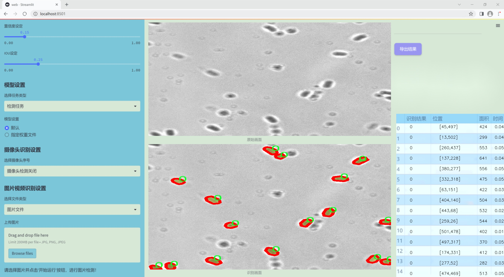

### 1.背景意义

研究背景与意义

随着计算机视觉技术的迅猛发展，实例分割作为其中一个重要的研究方向，逐渐引起了广泛的关注。实例分割不仅能够识别图像中的物体，还能精确地划分出每个物体的轮廓，这在许多实际应用中具有重要意义。尤其是在生物医学领域，孢子的检测与分析对于疾病的早期诊断和防治具有重要的科学价值和应用前景。孢子作为一种重要的生物体，广泛存在于自然界中，其数量和种类的变化常常与生态环境的变化密切相关。因此，开发一种高效、准确的孢子实例分割检测系统，能够为生态监测、环境保护以及农业生产提供重要的数据支持。

本研究旨在基于改进的YOLOv11模型，构建一个专门针对孢子的实例分割检测系统。该系统将利用一个包含1500张图像的数据集，其中包含两类目标（孢子和背景），为孢子的检测提供丰富的样本支持。通过对YOLOv11模型的改进，我们希望能够提高模型在孢子实例分割任务中的精度和鲁棒性。具体而言，改进将集中在模型的特征提取能力和后处理策略上，以更好地适应孢子在不同环境下的变化特征。

此外，随着数据集的不断扩展和技术的不断进步，基于深度学习的实例分割技术有望实现更高的自动化水平，从而减少人工标注的工作量，提高检测效率。通过本研究的开展，不仅可以推动孢子检测技术的发展，还能为相关领域的研究提供新的思路和方法，具有重要的理论价值和实际应用意义。

### 2.视频效果

[2.1 视频效果](https://www.bilibili.com/video/BV1tkkXYVEmw/)

### 3.图片效果




##### [项目涉及的源码数据来源链接](https://kdocs.cn/l/cszuIiCKVNis)**

注意：本项目提供训练的数据集和训练教程,由于版本持续更新,暂不提供权重文件（best.pt）,请按照6.训练教程进行训练后实现上图演示的效果。

### 4.数据集信息

##### 4.1 本项目数据集类别数＆类别名

nc: 2
names: ['0', 'object']


该项目为【图像分割】数据集，请在【训练教程和Web端加载模型教程（第三步）】这一步的时候按照【图像分割】部分的教程来训练

##### 4.2 本项目数据集信息介绍

本项目数据集信息介绍

本项目所使用的数据集名为“spore_trai”，旨在为改进YOLOv11的孢子实例分割检测系统提供必要的训练基础。该数据集专注于孢子的检测与分割，涵盖了与孢子相关的多种图像样本，旨在提高模型在实际应用中的准确性和鲁棒性。数据集中包含两个主要类别，分别为“0”和“object”，其中“0”代表背景或非目标区域，而“object”则专指孢子实例。这种简单而明确的类别划分，有助于模型在训练过程中更好地学习区分目标与背景，从而提升其检测性能。

数据集中的图像样本经过精心挑选与标注，确保了数据的多样性和代表性。样本包括不同形态、大小和颜色的孢子图像，反映了自然界中孢子的多样性。这种多样性不仅有助于提高模型的泛化能力，还能增强其在复杂环境下的表现。此外，数据集中还包含了不同光照条件和背景环境下的孢子图像，以模拟实际应用场景中的各种挑战。

在数据预处理阶段，所有图像均经过标准化处理，以确保输入数据的一致性。标注信息则采用高精度的实例分割标注方式，确保每个孢子实例都能被准确识别和分割。这一过程不仅提高了数据集的质量，也为后续的模型训练提供了坚实的基础。

通过使用“spore_trai”数据集，本项目希望能够有效提升YOLOv11在孢子实例分割任务中的表现，推动相关领域的研究与应用。随着模型的不断优化与迭代，预期能够实现更高的检测精度和更快的处理速度，为孢子相关的生物研究和生态监测提供强有力的技术支持。


### 5.全套项目环境部署视频教程（零基础手把手教学）

[5.1 所需软件PyCharm和Anaconda安装教程（第一步）](https://www.bilibili.com/video/BV1BoC1YCEKi/?spm_id_from=333.999.0.0&vd_source=bc9aec86d164b67a7004b996143742dc)


[5.2 安装Python虚拟环境创建和依赖库安装视频教程（第二步）](https://www.bilibili.com/video/BV1ZoC1YCEBw?spm_id_from=333.788.videopod.sections&vd_source=bc9aec86d164b67a7004b996143742dc)

### 6.改进YOLOv11训练教程和Web_UI前端加载模型教程（零基础手把手教学）

[6.1 改进YOLOv11训练教程和Web_UI前端加载模型教程（第三步）](https://www.bilibili.com/video/BV1BoC1YCEhR?spm_id_from=333.788.videopod.sections&vd_source=bc9aec86d164b67a7004b996143742dc)


按照上面的训练视频教程链接加载项目提供的数据集，运行train.py即可开始训练



     Epoch   gpu_mem       box       obj       cls    labels  img_size
     1/200     20.8G   0.01576   0.01955  0.007536        22      1280: 100%|██████████| 849/849 [14:42<00:00,  1.04s/it]
               Class     Images     Labels          P          R     mAP@.5 mAP@.5:.95: 100%|██████████| 213/213 [01:14<00:00,  2.87it/s]
                 all       3395      17314      0.994      0.957      0.0957      0.0843

     Epoch   gpu_mem       box       obj       cls    labels  img_size
     2/200     20.8G   0.01578   0.01923  0.007006        22      1280: 100%|██████████| 849/849 [14:44<00:00,  1.04s/it]
               Class     Images     Labels          P          R     mAP@.5 mAP@.5:.95: 100%|██████████| 213/213 [01:12<00:00,  2.95it/s]
                 all       3395      17314      0.996      0.956      0.0957      0.0845

     Epoch   gpu_mem       box       obj       cls    labels  img_size
     3/200     20.8G   0.01561    0.0191  0.006895        27      1280: 100%|██████████| 849/849 [10:56<00:00,  1.29it/s]
               Class     Images     Labels          P          R     mAP@.5 mAP@.5:.95: 100%|███████   | 187/213 [00:52<00:00,  4.04it/s]
                 all       3395      17314      0.996      0.957      0.0957      0.0845


###### [项目数据集下载链接](https://kdocs.cn/l/cszuIiCKVNis)

### 7.原始YOLOv11算法讲解

##### YOLO11简介

> YOLO11源码地址：https://github.com/ultralytics/ultralytics

Ultralytics
YOLO11是一款尖端的、最先进的模型，它在之前YOLO版本成功的基础上进行了构建，并引入了新功能和改进，以进一步提升性能和灵活性。YOLO11设计快速、准确且易于使用，使其成为各种物体检测和跟踪、实例分割、图像分类以及姿态估计任务的绝佳选择。  


**YOLO11创新点如下:**

YOLO 11主要改进包括：  
`增强的特征提取`：YOLO 11采用了改进的骨干和颈部架构，增强了特征提取功能，以实现更精确的目标检测。  
`优化的效率和速度`：优化的架构设计和优化的训练管道提供更快的处理速度，同时保持准确性和性能之间的平衡。  
`更高的精度，更少的参数`：YOLO11m在COCO数据集上实现了更高的平均精度（mAP），参数比YOLOv8m少22%，使其在不影响精度的情况下提高了计算效率。  
`跨环境的适应性`：YOLO 11可以部署在各种环境中，包括边缘设备、云平台和支持NVIDIA GPU的系统。  
`广泛的支持任务`：YOLO 11支持各种计算机视觉任务，如对象检测、实例分割、图像分类、姿态估计和面向对象检测（OBB）。

**YOLO11不同模型尺寸信息：**

YOLO11 提供5种不同的型号规模模型，以满足不同的应用需求：

Model| size (pixels)| mAPval 50-95| Speed CPU ONNX (ms)| Speed T4 TensorRT10
(ms)| params (M)| FLOPs (B)  
---|---|---|---|---|---|---  
YOLO11n| 640| 39.5| 56.1 ± 0.8| 1.5 ± 0.0| 2.6| 6.5  
YOLO11s| 640| 47.0| 90.0 ± 1.2| 2.5 ± 0.0| 9.4| 21.5  
YOLO11m| 640| 51.5| 183.2 ± 2.0| 4.7 ± 0.1| 20.1| 68.0  
YOLO11l| 640| 53.4| 238.6 ± 1.4| 6.2 ± 0.1| 25.3| 86.9  
YOLO11x| 640| 54.7| 462.8 ± 6.7| 11.3 ± 0.2| 56.9| 194.9  
  
**模型常用训练超参数参数说明：**  
`YOLOv11
模型的训练设置包括训练过程中使用的各种超参数和配置`。这些设置会影响模型的性能、速度和准确性。关键的训练设置包括批量大小、学习率、动量和权重衰减。此外，优化器、损失函数和训练数据集组成的选择也会影响训练过程。对这些设置进行仔细的调整和实验对于优化性能至关重要。  
**以下是一些常用的模型训练参数和说明：**

参数名| 默认值| 说明  
---|---|---  
`model`| `None`| 指定用于训练的模型文件。接受指向 `.pt` 预训练模型或 `.yaml`
配置文件。对于定义模型结构或初始化权重至关重要。  
`data`| `None`| 数据集配置文件的路径（例如
`coco8.yaml`).该文件包含特定于数据集的参数，包括训练数据和验证数据的路径、类名和类数。  
`epochs`| `100`| 训练总轮数。每个epoch代表对整个数据集进行一次完整的训练。调整该值会影响训练时间和模型性能。  
`patience`| `100`| 在验证指标没有改善的情况下，提前停止训练所需的epoch数。当性能趋于平稳时停止训练，有助于防止过度拟合。  
`batch`| `16`| 批量大小，有三种模式:设置为整数(例如，’ Batch =16 ‘)， 60% GPU内存利用率的自动模式(’ Batch
=-1 ‘)，或指定利用率分数的自动模式(’ Batch =0.70 ')。  
`imgsz`| `640`| 用于训练的目标图像尺寸。所有图像在输入模型前都会被调整到这一尺寸。影响模型精度和计算复杂度。  
`device`| `None`| 指定用于训练的计算设备：单个 GPU (`device=0`）、多个 GPU (`device=0,1`)、CPU
(`device=cpu`)，或苹果芯片的 MPS (`device=mps`).  
`workers`| `8`| 加载数据的工作线程数（每 `RANK` 多 GPU 训练）。影响数据预处理和输入模型的速度，尤其适用于多 GPU 设置。  
`name`| `None`| 训练运行的名称。用于在项目文件夹内创建一个子目录，用于存储训练日志和输出结果。  
`pretrained`| `True`| 决定是否从预处理模型开始训练。可以是布尔值，也可以是加载权重的特定模型的字符串路径。提高训练效率和模型性能。  
`optimizer`| `'auto'`| 为训练模型选择优化器。选项包括 `SGD`, `Adam`, `AdamW`, `NAdam`,
`RAdam`, `RMSProp` 等，或 `auto` 用于根据模型配置进行自动选择。影响收敛速度和稳定性  
`lr0`| `0.01`| 初始学习率（即 `SGD=1E-2`, `Adam=1E-3`) .调整这个值对优化过程至关重要，会影响模型权重的更新速度。  
`lrf`| `0.01`| 最终学习率占初始学习率的百分比 = (`lr0 * lrf`)，与调度程序结合使用，随着时间的推移调整学习率。  


**各损失函数作用说明：**  
`定位损失box_loss`：预测框与标定框之间的误差（GIoU），越小定位得越准；  
`分类损失cls_loss`：计算锚框与对应的标定分类是否正确，越小分类得越准；  
`动态特征损失（dfl_loss）`：DFLLoss是一种用于回归预测框与目标框之间距离的损失函数。在计算损失时，目标框需要缩放到特征图尺度，即除以相应的stride，并与预测的边界框计算Ciou
Loss，同时与预测的anchors中心点到各边的距离计算回归DFLLoss。  


### 8.200+种全套改进YOLOV11创新点原理讲解

#### 8.1 200+种全套改进YOLOV11创新点原理讲解大全

由于篇幅限制，每个创新点的具体原理讲解就不全部展开，具体见下列网址中的改进模块对应项目的技术原理博客网址【Blog】（创新点均为模块化搭建，原理适配YOLOv5~YOLOv11等各种版本）

[改进模块技术原理博客【Blog】网址链接](https://gitee.com/qunmasj/good)


#### 8.2 精选部分改进YOLOV11创新点原理讲解

###### 这里节选部分改进创新点展开原理讲解(完整的改进原理见上图和[改进模块技术原理博客链接](https://gitee.com/qunmasj/good)【如果此小节的图加载失败可以通过CSDN或者Github搜索该博客的标题访问原始博客，原始博客图片显示正常】


#### 特征融合

模型架构图如下

  Darknet-53的特点可以这样概括：（Conv卷积模块+Residual Block残差块）串行叠加4次

  Conv卷积层+Residual Block残差网络就被称为一个stage


上面红色指出的那个，原始的Darknet-53里面有一层 卷积，在YOLOv11里面，把一层卷积移除了

为什么移除呢？

        原始Darknet-53模型中间加的这个卷积层做了什么？滤波器（卷积核）的个数从 上一个卷积层的512个，先增加到1024个卷积核，然后下一层卷积的卷积核的个数又降低到512个

        移除掉这一层以后，少了1024个卷积核，就可以少做1024次卷积运算，同时也少了1024个3×3的卷积核的参数，也就是少了9×1024个参数需要拟合。这样可以大大减少了模型的参数，（相当于做了轻量化吧）

        移除掉这个卷积层，可能是因为作者发现移除掉这个卷积层以后，模型的score有所提升，所以才移除掉的。为什么移除掉以后，分数有所提高呢？可能是因为多了这些参数就容易，参数过多导致模型在训练集删过拟合，但是在测试集上表现很差，最终模型的分数比较低。你移除掉这个卷积层以后，参数减少了，过拟合现象不那么严重了，泛化能力增强了。当然这个是，拿着你做实验的结论，反过来再找补，再去强行解释这种现象的合理性。


通过MMdetection官方绘制册这个图我们可以看到，进来的这张图片经过一个“Feature Pyramid Network(简称FPN)”，然后最后的P3、P4、P5传递给下一层的Neck和Head去做识别任务。 PAN（Path Aggregation Network）


“FPN是自顶向下，将高层的强语义特征传递下来。PAN就是在FPN的后面添加一个自底向上的金字塔，对FPN补充，将低层的强定位特征传递上去，

FPN是自顶（小尺寸，卷积次数多得到的结果，语义信息丰富）向下（大尺寸，卷积次数少得到的结果），将高层的强语义特征传递下来，对整个金字塔进行增强，不过只增强了语义信息，对定位信息没有传递。PAN就是针对这一点，在FPN的后面添加一个自底（卷积次数少，大尺寸）向上（卷积次数多，小尺寸，语义信息丰富）的金字塔，对FPN补充，将低层的强定位特征传递上去，又被称之为“双塔战术”。

FPN层自顶向下传达强语义特征，而特征金字塔则自底向上传达强定位特征，两两联手，从不同的主干层对不同的检测层进行参数聚合,这样的操作确实很皮。
#### 自底向上增强


而 PAN（Path Aggregation Network）是对 FPN 的一种改进，它的设计理念是在 FPN 后面添加一个自底向上的金字塔。PAN 引入了路径聚合的方式，通过将浅层特征图（低分辨率但语义信息较弱）和深层特征图（高分辨率但语义信息丰富）进行聚合，并沿着特定的路径传递特征信息，将低层的强定位特征传递上去。这样的操作能够进一步增强多尺度特征的表达能力，使得 PAN 在目标检测任务中表现更加优秀。


### Gold-YOLO简介
YOLO系列模型面世至今已有8年，由于其优异的性能，已成为目标检测领域的标杆。在系列模型经过十多个不同版本的改进发展逐渐稳定完善的今天，研究人员更多关注于单个计算模块内结构的精细调整，或是head部分和训练方法上的改进。但这并不意味着现有模式已是最优解。

当前YOLO系列模型通常采用类FPN方法进行信息融合，而这一结构在融合跨层信息时存在信息损失的问题。针对这一问题，我们提出了全新的信息聚集-分发（Gather-and-Distribute Mechanism）GD机制，通过在全局视野上对不同层级的特征进行统一的聚集融合并分发注入到不同层级中，构建更加充分高效的信息交互融合机制，并基于GD机制构建了Gold-YOLO。在COCO数据集中，我们的Gold-YOLO超越了现有的YOLO系列，实现了精度-速度曲线上的SOTA。


精度和速度曲线（TensorRT7）


精度和速度曲线（TensorRT8）
传统YOLO的问题
在检测模型中，通常先经过backbone提取得到一系列不同层级的特征，FPN利用了backbone的这一特点，构建了相应的融合结构：不层级的特征包含着不同大小物体的位置信息，虽然这些特征包含的信息不同，但这些特征在相互融合后能够互相弥补彼此缺失的信息，增强每一层级信息的丰富程度，提升网络性能。

原始的FPN结构由于其层层递进的信息融合模式，使得相邻层的信息能够充分融合，但也导致了跨层信息融合存在问题：当跨层的信息进行交互融合时，由于没有直连的交互通路，只能依靠中间层充当“中介”进行融合，导致了一定的信息损失。之前的许多工作中都关注到了这一问题，而解决方案通常是通过添加shortcut增加更多的路径，以增强信息流动。

然而传统的FPN结构即便改进后，由于网络中路径过多，且交互方式不直接，基于FPN思想的信息融合结构仍然存在跨层信息交互困难和信息损失的问题。

#### Gold-YOLO：全新的信息融合交互机制


#### Gold-YOLO架构
参考该博客提出的一种全新的信息交互融合机制：信息聚集-分发机制(Gather-and-Distribute Mechanism)。该机制通过在全局上融合不同层次的特征得到全局信息，并将全局信息注入到不同层级的特征中，实现了高效的信息交互和融合。在不显著增加延迟的情况下GD机制显著增强了Neck部分的信息融合能力，提高了模型对不同大小物体的检测能力。

GD机制通过三个模块实现：信息对齐模块(FAM)、信息融合模块(IFM)和信息注入模块(Inject)。

信息对齐模块负责收集并对齐不同层级不同大小的特征

信息融合模块通过使用卷积或Transformer算子对对齐后的的特征进行融合，得到全局信息

信息注入模块将全局信息注入到不同层级中

在Gold-YOLO中，针对模型需要检测不同大小的物体的需要，并权衡精度和速度，我们构建了两个GD分支对信息进行融合：低层级信息聚集-分发分支(Low-GD)和高层级信息聚集-分发分支(High-GD)，分别基于卷积和transformer提取和融合特征信息。

此外,为了促进局部信息的流动，我们借鉴现有工作，构建了一个轻量级的邻接层融合模块，该模块在局部尺度上结合了邻近层的特征，进一步提升了模型性能。我们还引入并验证了预训练方法对YOLO模型的有效性，通过在ImageNet 1K上使用MAE方法对主干进行预训练，显著提高了模型的收敛速度和精度。


### 9.系统功能展示

图9.1.系统支持检测结果表格显示

  图9.2.系统支持置信度和IOU阈值手动调节

  图9.3.系统支持自定义加载权重文件best.pt(需要你通过步骤5中训练获得)

  图9.4.系统支持摄像头实时识别

  图9.5.系统支持图片识别

  图9.6.系统支持视频识别

  图9.7.系统支持识别结果文件自动保存

  图9.8.系统支持Excel导出检测结果数据


### 10. YOLOv11核心改进源码讲解

#### 10.1 SMPConv.py

下面是对给定代码的核心部分进行分析和注释的结果。代码的主要功能是实现一种新的卷积神经网络模块，使用了一些自定义的卷积操作和标准的卷积操作。以下是精简后的核心代码及详细注释：

```python
import torch
import torch.nn as nn
import torch.nn.functional as F

# 定义相对位置的函数
def rel_pos(kernel_size):
    # 生成从-1到1的线性空间，作为卷积核的坐标
    tensors = [torch.linspace(-1, 1, steps=kernel_size) for _ in range(2)]
    kernel_coord = torch.stack(torch.meshgrid(*tensors), dim=-0)
    kernel_coord = kernel_coord.unsqueeze(0)  # 增加一个维度
    return kernel_coord

# 自定义卷积类
class SMPConv(nn.Module):
    def __init__(self, planes, kernel_size, n_points, stride, padding, groups):
        super().__init__()
        self.planes = planes
        self.kernel_size = kernel_size
        self.n_points = n_points
        self.init_radius = 2 * (2/kernel_size)

        # 初始化卷积核坐标
        kernel_coord = rel_pos(kernel_size)
        self.register_buffer('kernel_coord', kernel_coord)

        # 初始化权重坐标
        weight_coord = torch.empty(1, n_points, 2)
        nn.init.trunc_normal_(weight_coord, std=0.2, a=-1., b=1.)
        self.weight_coord = nn.Parameter(weight_coord)

        # 初始化半径
        self.radius = nn.Parameter(torch.empty(1, n_points).unsqueeze(-1).unsqueeze(-1))
        self.radius.data.fill_(value=self.init_radius)

        # 初始化权重
        weights = torch.empty(1, planes, n_points)
        nn.init.trunc_normal_(weights, std=.02)
        self.weights = nn.Parameter(weights)

    def forward(self, x):
        # 生成卷积核并进行卷积操作
        kernels = self.make_kernels().unsqueeze(1)
        x = x.contiguous()
        kernels = kernels.contiguous()

        # 根据输入数据类型选择不同的卷积实现
        if x.dtype == torch.float32:
            x = _DepthWiseConv2dImplicitGEMMFP32.apply(x, kernels)
        elif x.dtype == torch.float16:
            x = _DepthWiseConv2dImplicitGEMMFP16.apply(x, kernels)
        else:
            raise TypeError("Only support fp32 and fp16, get {}".format(x.dtype))
        return x        

    def make_kernels(self):
        # 计算卷积核
        diff = self.weight_coord.unsqueeze(-2) - self.kernel_coord.reshape(1, 2, -1).transpose(1, 2)  # 计算权重坐标与卷积核坐标的差
        diff = diff.transpose(2, 3).reshape(1, self.n_points, 2, self.kernel_size, self.kernel_size)
        diff = F.relu(1 - torch.sum(torch.abs(diff), dim=2) / self.radius)  # 计算卷积核的权重
        
        # 生成最终的卷积核
        kernels = torch.matmul(self.weights, diff.reshape(1, self.n_points, -1))  # 计算加权卷积核
        kernels = kernels.reshape(1, self.planes, *self.kernel_coord.shape[2:])  # 调整形状
        kernels = kernels.squeeze(0)
        kernels = torch.flip(kernels.permute(0, 2, 1), dims=(1,))  # 翻转卷积核
        return kernels

# 自定义卷积神经网络模块
class SMPCNN(nn.Module):
    def __init__(self, in_channels, out_channels, kernel_size, stride, groups, n_points=None):
        super().__init__()
        padding = kernel_size // 2
        self.smp = SMPConv(in_channels, kernel_size, n_points, stride, padding, groups)  # 使用自定义卷积
        self.small_conv = nn.Conv2d(in_channels, out_channels, kernel_size=5, stride=stride, padding=2, groups=groups)  # 使用标准卷积

    def forward(self, inputs):
        # 进行前向传播
        out = self.smp(inputs)  # 自定义卷积
        out += self.small_conv(inputs)  # 标准卷积
        return out

# 自定义块
class SMPBlock(nn.Module):
    def __init__(self, in_channels, dw_channels, lk_size, drop_path):
        super().__init__()
        self.pw1 = nn.Sequential(nn.Conv2d(in_channels, dw_channels, kernel_size=1, stride=1, padding=0), nn.BatchNorm2d(dw_channels), nn.ReLU())
        self.pw2 = nn.Conv2d(dw_channels, in_channels, kernel_size=1, stride=1, padding=0)
        self.large_kernel = SMPCNN(in_channels=dw_channels, out_channels=dw_channels, kernel_size=lk_size, stride=1, groups=dw_channels)
        self.drop_path = nn.Identity()  # Drop path placeholder

    def forward(self, x):
        out = self.pw1(x)  # 逐点卷积
        out = self.large_kernel(out)  # 大卷积
        out = self.pw2(out)  # 逐点卷积
        return x + self.drop_path(out)  # 残差连接
```

### 代码核心部分分析
1. **SMPConv**: 这是一个自定义的卷积层，使用相对位置编码和动态生成的卷积核。通过`make_kernels`方法生成卷积核，并在`forward`方法中应用这些卷积核。

2. **SMPCNN**: 这个类结合了自定义卷积和标准卷积。它的`forward`方法将两种卷积的输出相加，实现了特征的融合。

3. **SMPBlock**: 这是一个模块化的块，包含逐点卷积和自定义卷积，支持残差连接。它在网络中可以重复使用，构成更深的网络结构。

这些模块和方法共同构成了一个灵活且强大的卷积神经网络结构，适用于多种计算机视觉任务。

该文件定义了一个名为 `SMPConv` 的卷积模块以及其他相关的神经网络组件，主要用于深度学习中的卷积操作。文件中使用了 PyTorch 框架，并引入了一些其他模块和库。以下是对代码的逐步分析和说明。

首先，文件中导入了必要的库，包括 `torch` 和 `torch.nn`，以及一些特定的功能模块，如 `Conv` 和 `DropPath`。在尝试导入深度可分离卷积的实现时，如果导入失败，则会捕获异常。

接下来，定义了一个 `rel_pos` 函数，用于生成相对位置的坐标张量，这对于卷积核的生成是必要的。该函数使用 `torch.linspace` 创建一个从 -1 到 1 的线性空间，并通过 `torch.meshgrid` 生成坐标网格。

`SMPConv` 类是该文件的核心部分，继承自 `nn.Module`。在初始化方法中，传入了一些参数，如输出通道数、卷积核大小、点数、步幅、填充和分组数。它首先计算相对位置的坐标，并将其注册为缓冲区。接着，初始化权重坐标和半径，并定义卷积权重。权重通过截断正态分布进行初始化。

在 `forward` 方法中，输入数据 `x` 经过 `make_kernels` 方法生成的卷积核进行卷积操作。根据输入数据的类型（FP32 或 FP16），选择不同的深度可分离卷积实现进行计算。

`make_kernels` 方法负责生成卷积核。它通过计算权重坐标与卷积核坐标之间的差异，并使用 ReLU 激活函数进行处理，最终生成加权的卷积核。

`radius_clip` 方法用于限制半径的范围，确保其在指定的最小值和最大值之间。

接下来，定义了 `get_conv2d` 函数，根据输入参数决定返回自定义的 `SMPConv` 或标准的 `nn.Conv2d`。此外，还定义了用于同步批归一化的函数 `get_bn` 和 `conv_bn`，后者创建一个包含卷积和批归一化的序列模块。

`conv_bn_relu` 函数在 `conv_bn` 的基础上添加了 ReLU 激活函数，形成一个完整的卷积-批归一化-激活的模块。

`fuse_bn` 函数用于将卷积层和批归一化层融合，以提高推理速度。

`SMPCNN` 类实现了一个复合卷积模块，结合了 `SMPConv` 和一个小卷积层。它在 `forward` 方法中将两个卷积的输出相加。

`SMPCNN_ConvFFN` 类实现了一个前馈网络模块，包含两个逐点卷积层和一个非线性激活函数。它在 `forward` 方法中对输入进行处理，并通过残差连接返回结果。

最后，`SMPBlock` 类实现了一个基本的块结构，包含两个逐点卷积和一个大型卷积模块。它使用 ReLU 激活函数和 DropPath 进行正则化，增强了网络的表现能力。

总体来说，该文件实现了一种新型的卷积操作和网络结构，旨在提高卷积神经网络的效率和性能，特别是在处理高维数据时。

#### 10.2 head.py

以下是代码中最核心的部分，保留了 `Detect_DyHead` 类，并添加了详细的中文注释：

```python
import torch
import torch.nn as nn
import math

class Detect_DyHead(nn.Module):
    """YOLOv8 检测头，使用动态头（DyHead）进行目标检测。"""
    
    dynamic = False  # 强制网格重建
    export = False  # 导出模式
    shape = None  # 形状初始化
    anchors = torch.empty(0)  # 锚框初始化
    strides = torch.empty(0)  # 步幅初始化

    def __init__(self, nc=80, hidc=256, block_num=2, ch=()):
        """
        初始化检测层。
        
        参数：
        nc (int): 类别数量
        hidc (int): 隐藏层通道数
        block_num (int): 动态头块的数量
        ch (tuple): 输入通道数
        """
        super().__init__()
        self.nc = nc  # 类别数量
        self.nl = len(ch)  # 检测层数量
        self.reg_max = 16  # DFL 通道数
        self.no = nc + self.reg_max * 4  # 每个锚框的输出数量
        self.stride = torch.zeros(self.nl)  # 构建时计算的步幅
        c2, c3 = max((16, ch[0] // 4, self.reg_max * 4)), max(ch[0], self.nc)  # 通道数
        self.conv = nn.ModuleList(nn.Sequential(Conv(x, hidc, 1)) for x in ch)  # 卷积层
        self.dyhead = nn.Sequential(*[DyHeadBlock(hidc) for i in range(block_num)])  # 动态头块
        self.cv2 = nn.ModuleList(
            nn.Sequential(Conv(hidc, c2, 3), Conv(c2, c2, 3), nn.Conv2d(c2, 4 * self.reg_max, 1)) for _ in ch
        )  # 处理锚框的卷积层
        self.cv3 = nn.ModuleList(
            nn.Sequential(
                nn.Sequential(DWConv(hidc, x, 3), Conv(x, c3, 1)),  # 深度卷积
                nn.Sequential(DWConv(c3, c3, 3), Conv(c3, c3, 1)),  # 深度卷积
                nn.Conv2d(c3, self.nc, 1),  # 输出类别
            )
            for x in ch
        )
        self.dfl = DFL(self.reg_max) if self.reg_max > 1 else nn.Identity()  # DFL层

    def forward(self, x):
        """连接并返回预测的边界框和类别概率。"""
        for i in range(self.nl):
            x[i] = self.conv[i](x[i])  # 通过卷积层处理输入
        x = self.dyhead(x)  # 通过动态头块处理
        shape = x[0].shape  # 获取形状 BCHW
        for i in range(self.nl):
            x[i] = torch.cat((self.cv2[i](x[i]), self.cv3[i](x[i])), 1)  # 连接处理后的输出
        if self.training:
            return x  # 如果是训练模式，返回处理后的输出
        elif self.dynamic or self.shape != shape:
            # 如果是动态模式或形状发生变化，重新计算锚框和步幅
            self.anchors, self.strides = (x.transpose(0, 1) for x in make_anchors(x, self.stride, 0.5))
            self.shape = shape

        # 将所有输出拼接在一起
        x_cat = torch.cat([xi.view(shape[0], self.no, -1) for xi in x], 2)
        box, cls = x_cat.split((self.reg_max * 4, self.nc), 1)  # 分割边界框和类别
        dbox = dist2bbox(self.dfl(box), self.anchors.unsqueeze(0), xywh=True, dim=1) * self.strides  # 解码边界框
        y = torch.cat((dbox, cls.sigmoid()), 1)  # 拼接边界框和类别概率
        return y if self.export else (y, x)  # 返回结果

    def bias_init(self):
        """初始化检测头的偏置，警告：需要步幅可用。"""
        m = self  # 检测模块
        for a, b, s in zip(m.cv2, m.cv3, m.stride):  # 遍历 cv2 和 cv3
            a[-1].bias.data[:] = 1.0  # 边界框偏置初始化
            b[-1].bias.data[:m.nc] = math.log(5 / m.nc / (640 / s) ** 2)  # 类别偏置初始化
```

### 代码说明
1. **类的定义**：`Detect_DyHead` 类继承自 `nn.Module`，用于实现 YOLOv8 的检测头。
2. **初始化方法**：`__init__` 方法中定义了网络的结构，包括卷积层、动态头块和 DFL 层。
3. **前向传播**：`forward` 方法实现了前向传播的逻辑，包括输入的处理、动态头块的应用、锚框的生成以及最终的输出拼接。
4. **偏置初始化**：`bias_init` 方法用于初始化网络的偏置，确保模型在训练开始时的稳定性。

这个文件 `head.py` 是一个用于目标检测模型的 PyTorch 模块，主要实现了 YOLOv8 的检测头（Detect Head）。该文件包含多个类，每个类实现了不同的检测头，支持多种检测任务，如目标检测、分割、姿态估计等。以下是对文件内容的详细说明。

首先，文件导入了一些必要的库，包括数学库、深度学习框架 PyTorch 及其相关模块，以及一些自定义的模块和函数。这些导入为后续的模型构建提供了基础。

文件中的类主要分为以下几类：

1. **Detect_DyHead**: 这是 YOLOv8 的基本检测头，使用动态头（DyHead）进行目标检测。它的构造函数接受类别数、隐藏通道数、块数和通道列表等参数。`forward` 方法实现了前向传播，返回预测的边界框和类别概率。

2. **Detect_AFPN_P345 和 Detect_AFPN_P2345**: 这些类实现了带有自适应特征金字塔网络（AFPN）的检测头，适用于不同的层次结构。AFPN 可以有效地融合不同尺度的特征，以提高检测性能。

3. **Detect_Efficient**: 这是一个高效的检测头，使用更少的参数和计算量来实现目标检测，适合资源受限的环境。

4. **DetectAux**: 这个类实现了一个辅助检测头，通常用于多任务学习，可以同时进行主任务和辅助任务的训练。

5. **Detect_SEAM 和 Detect_MultiSEAM**: 这些类实现了带有 SEAM（Squeeze-and-Excitation Attention Module）机制的检测头，能够增强特征的表达能力。MultiSEAM 版本支持多通道的注意力机制。

6. **Detect_LSCD 和 Detect_LSCSBD**: 这些类实现了轻量级共享卷积检测头，旨在减少模型的计算量和参数数量，同时保持良好的检测性能。

7. **Detect_TADDH**: 这是一个任务动态对齐检测头，使用动态卷积和任务分解技术来提高检测精度。

8. **Detect_LADH**: 这是一个轻量级的检测头，采用深度可分离卷积（DSConv）来减少计算量。

9. **Segment_* 和 Pose_* 类**: 这些类实现了针对分割和姿态估计任务的检测头，扩展了基本的检测功能，支持更复杂的任务。

每个类的 `forward` 方法实现了前向传播逻辑，通常包括特征提取、边界框回归和类别预测等步骤。此外，文件中还包含了一些辅助方法，如 `bias_init` 用于初始化偏置参数，`decode_bboxes` 用于解码边界框等。

整体而言，这个文件实现了 YOLOv8 模型的多个检测头，支持多种任务和结构，具有灵活性和扩展性。通过不同的检测头，用户可以根据具体需求选择合适的模型进行目标检测、分割或姿态估计等任务。

#### 10.3 prepbn.py

以下是经过简化并添加详细中文注释的核心代码部分：

```python
import torch
import torch.nn as nn

# 定义一个自定义的批量归一化类
class RepBN(nn.Module):
    def __init__(self, channels):
        super(RepBN, self).__init__()
        # 初始化一个可学习的参数 alpha，初始值为 1
        self.alpha = nn.Parameter(torch.ones(1))
        # 使用 PyTorch 的 BatchNorm1d 进行一维批量归一化
        self.bn = nn.BatchNorm1d(channels)

    def forward(self, x):
        # 将输入张量的维度进行转置，以适应 BatchNorm1d 的输入格式
        x = x.transpose(1, 2)
        # 进行批量归一化，并加上 alpha 乘以输入 x
        x = self.bn(x) + self.alpha * x
        # 再次转置回原来的维度
        x = x.transpose(1, 2)
        return x

# 定义一个线性归一化类
class LinearNorm(nn.Module):
    def __init__(self, dim, norm1, norm2, warm=0, step=300000, r0=1.0):
        super(LinearNorm, self).__init__()
        # 注册一些缓冲区变量，用于控制训练过程中的参数
        self.register_buffer('warm', torch.tensor(warm))  # 预热步数
        self.register_buffer('iter', torch.tensor(step))   # 当前迭代步数
        self.register_buffer('total_step', torch.tensor(step))  # 总步数
        self.r0 = r0  # 初始比例
        self.norm1 = norm1(dim)  # 第一个归一化层
        self.norm2 = norm2(dim)  # 第二个归一化层

    def forward(self, x):
        if self.training:  # 如果处于训练模式
            if self.warm > 0:  # 如果还有预热步数
                self.warm.copy_(self.warm - 1)  # 减少预热步数
                x = self.norm1(x)  # 仅使用第一个归一化层
            else:
                # 计算当前的比例 lamda
                lamda = self.r0 * self.iter / self.total_step
                if self.iter > 0:
                    self.iter.copy_(self.iter - 1)  # 减少迭代步数
                # 使用两个归一化层处理输入
                x1 = self.norm1(x)
                x2 = self.norm2(x)
                # 根据 lamda 加权组合两个归一化结果
                x = lamda * x1 + (1 - lamda) * x2
        else:
            # 如果处于评估模式，直接使用第二个归一化层
            x = self.norm2(x)
        return x
```

### 代码说明：
1. **RepBN 类**：实现了一种改进的批量归一化方法，通过引入可学习的参数 `alpha`，在标准的批量归一化输出基础上加上了输入的加权部分，增强了模型的表达能力。
  
2. **LinearNorm 类**：实现了一种动态归一化策略，结合了两个不同的归一化方法（`norm1` 和 `norm2`）。在训练初期通过预热阶段使用第一个归一化方法，之后根据当前迭代次数动态调整两个归一化方法的加权比例，提升了模型的适应性和稳定性。

这个程序文件定义了两个神经网络模块，分别是 `RepBN` 和 `LinearNorm`，它们都继承自 PyTorch 的 `nn.Module` 类。

`RepBN` 类是一个自定义的批量归一化模块。它的构造函数接受一个参数 `channels`，用于指定输入数据的通道数。在初始化过程中，它创建了一个可学习的参数 `alpha`，并初始化了一个标准的批量归一化层 `bn`。在 `forward` 方法中，输入张量 `x` 首先进行了维度的转置，以适应批量归一化的要求。接着，经过批量归一化处理后，结果与 `alpha` 乘以原始输入相加，最后再进行一次转置以恢复原来的维度。这种设计允许模型在批量归一化的基础上引入额外的可学习参数，从而增强了模型的表达能力。

`LinearNorm` 类实现了一个线性归一化模块，构造函数接受多个参数，包括维度 `dim`、两个归一化函数 `norm1` 和 `norm2`，以及一些控制参数如 `warm` 和 `step`。在初始化时，它注册了一些缓冲区变量，这些变量在训练过程中会被用来控制归一化的行为。在 `forward` 方法中，首先检查模型是否处于训练模式。如果是且 `warm` 大于零，则执行 `norm1` 归一化，并减少 `warm` 的值。否则，计算一个线性插值系数 `lamda`，根据当前的迭代次数来决定使用 `norm1` 还是 `norm2` 进行归一化处理，最终将两者按比例加权结合。如果模型不在训练模式下，则直接使用 `norm2` 进行归一化。

总体来说，这两个模块通过自定义的归一化方式来增强神经网络的性能，特别是在处理不同的输入特征时，可以灵活地调整归一化策略。

#### 10.4 mamba_vss.py

以下是代码中最核心的部分，并附上详细的中文注释：

```python
import torch
import torch.nn as nn
import torch.nn.functional as F
from einops import repeat
from timm.layers import DropPath

class SS2D(nn.Module):
    def __init__(self, d_model, d_state=16, d_conv=3, expand=2, dropout=0., bias=False, device=None, dtype=None):
        super().__init__()
        # 初始化模型参数
        self.d_model = d_model  # 输入特征维度
        self.d_state = d_state  # 状态维度
        self.d_conv = d_conv  # 卷积核大小
        self.expand = expand  # 扩展因子
        self.d_inner = int(self.expand * self.d_model)  # 内部特征维度
        factory_kwargs = {"device": device, "dtype": dtype}

        # 输入投影层，将输入特征维度映射到内部特征维度
        self.in_proj = nn.Linear(self.d_model, self.d_inner * 2, bias=bias, **factory_kwargs)
        
        # 卷积层，使用深度可分离卷积
        self.conv2d = nn.Conv2d(
            in_channels=self.d_inner,
            out_channels=self.d_inner,
            groups=self.d_inner,
            bias=True,
            kernel_size=d_conv,
            padding=(d_conv - 1) // 2,
            **factory_kwargs,
        )
        
        self.act = nn.SiLU()  # 激活函数

        # 初始化输出层
        self.out_norm = nn.LayerNorm(self.d_inner)
        self.out_proj = nn.Linear(self.d_inner, self.d_model, bias=bias, **factory_kwargs)
        self.dropout = nn.Dropout(dropout) if dropout > 0. else None

    def forward(self, x: torch.Tensor):
        # 前向传播函数
        B, H, W, C = x.shape  # 获取输入的批次大小、高度、宽度和通道数

        # 输入投影
        xz = self.in_proj(x)
        x, z = xz.chunk(2, dim=-1)  # 将投影结果分为两个部分

        # 转换维度以适应卷积层
        x = x.permute(0, 3, 1, 2).contiguous()  # (B, C, H, W)
        x = self.act(self.conv2d(x))  # 卷积操作和激活函数
        y = self.forward_core(x)  # 核心前向传播
        y = y * F.silu(z)  # 使用z作为门控机制
        out = self.out_proj(y)  # 输出层
        if self.dropout is not None:
            out = self.dropout(out)  # 应用dropout
        return out

    def forward_core(self, x: torch.Tensor):
        # 核心前向传播逻辑
        B, C, H, W = x.shape
        L = H * W  # 计算序列长度
        K = 4  # 复制的数量

        # 将输入转换为适合后续计算的格式
        x_hwwh = torch.stack([x.view(B, -1, L), torch.transpose(x, dim0=2, dim1=3).contiguous().view(B, -1, L)], dim=1).view(B, 2, -1, L)
        xs = torch.cat([x_hwwh, torch.flip(x_hwwh, dims=[-1])], dim=1)  # 拼接正向和反向序列

        # 计算状态和时间步长
        dts, Bs, Cs = torch.split(xs, [self.dt_rank, self.d_state, self.d_state], dim=2)
        # 进一步处理
        # 省略具体的实现细节，假设有复杂的状态转移逻辑

        # 最终输出
        return y  # 返回处理后的结果

class VSSBlock(nn.Module):
    def __init__(self, hidden_dim: int = 0, drop_path: float = 0.2, d_state: int = 16):
        super().__init__()
        self.ln_1 = nn.LayerNorm(hidden_dim)  # 归一化层
        self.self_attention = SS2D(d_model=hidden_dim, d_state=d_state)  # 自注意力模块
        self.drop_path = DropPath(drop_path)  # 随机丢弃路径

    def forward(self, input: torch.Tensor):
        input = input.permute((0, 2, 3, 1))  # 转换维度
        x = input + self.drop_path(self.self_attention(self.ln_1(input)))  # 残差连接
        return x.permute((0, 3, 1, 2))  # 返回到原始维度

# 代码的主入口
if __name__ == '__main__':
    inputs = torch.randn((1, 64, 32, 32)).cuda()  # 随机生成输入
    model = VSSBlock(64).cuda()  # 实例化模型
    pred = model(inputs)  # 前向传播
    print(pred.size())  # 输出结果的尺寸
```

### 代码核心部分说明：
1. **SS2D类**：实现了一个包含输入投影、卷积层和核心前向传播逻辑的模块。该模块使用深度可分离卷积和自注意力机制来处理输入数据。
2. **VSSBlock类**：使用SS2D模块构建了一个块，包含归一化层和随机丢弃路径，支持残差连接。
3. **前向传播**：实现了输入的投影、卷积、核心计算和输出层的处理逻辑。

以上是代码的核心部分及其详细注释，帮助理解模型的结构和功能。

这个程序文件 `mamba_vss.py` 定义了几个神经网络模块，主要包括 `SS2D`、`VSSBlock` 和 `Mamba2Block`。这些模块是基于 PyTorch 框架构建的，主要用于实现某种形式的自注意力机制和卷积操作，适用于深度学习任务。

首先，`SS2D` 类是一个自定义的神经网络模块，继承自 `nn.Module`。它的构造函数接受多个参数，如 `d_model`、`d_state`、`d_conv` 等，这些参数用于定义模型的维度、状态和卷积层的配置。模块内部包含多个线性层和卷积层，使用了 SiLU 激活函数。`SS2D` 的核心是 `forward_corev0` 方法，它实现了一个选择性扫描的机制，用于处理输入张量。该方法通过对输入进行多次变换和计算，最终输出一个经过处理的张量。

`VSSBlock` 类也是一个神经网络模块，继承自 `nn.Module`。它包含一个归一化层和一个自注意力层（`SS2D` 实例）。在 `forward` 方法中，输入张量首先经过归一化，然后通过自注意力层进行处理，最后与原始输入相加，形成残差连接。这个模块的设计旨在增强模型的特征提取能力。

`Mamba2Block` 类继承自 `VSSBlock`，并替换了自注意力层为 `Mamba2Simple`，这是另一个自定义的模块。它的 `forward` 方法与 `VSSBlock` 类似，但在处理输入时进行了额外的维度变换，以适应新的自注意力机制。

在文件的最后部分，有一个主程序块，用于测试这些模块。它生成随机输入张量，并实例化 `VSSBlock` 和 `Mamba2Block`，然后将输入传递给这些模型，输出预测结果的尺寸。

整体来看，这个文件实现了一个复杂的神经网络结构，结合了自注意力机制和卷积操作，适用于图像处理或其他需要特征提取的任务。

### 11.完整训练+Web前端界面+200+种全套创新点源码、数据集获取


# [下载链接：https://mbd.pub/o/bread/Z5ycm5xs](https://mbd.pub/o/bread/Z5ycm5xs)